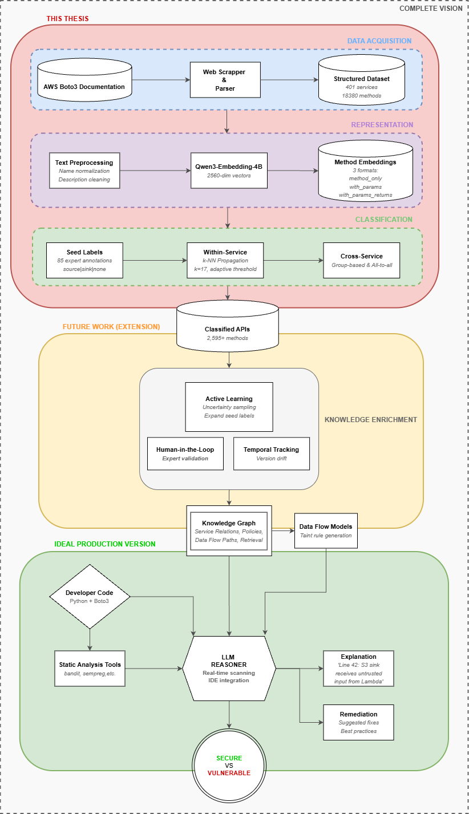
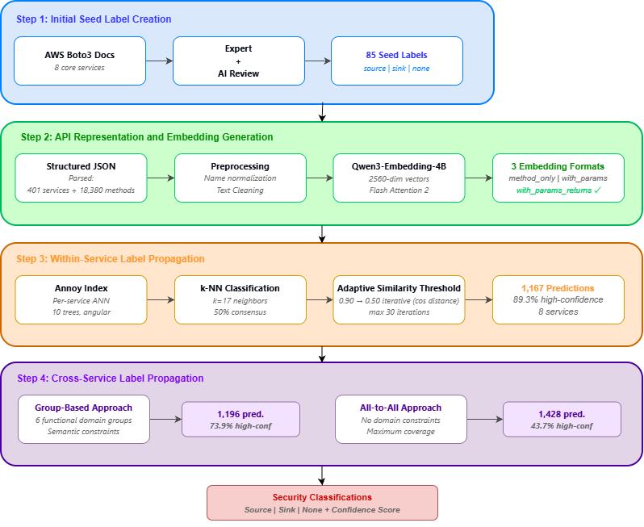
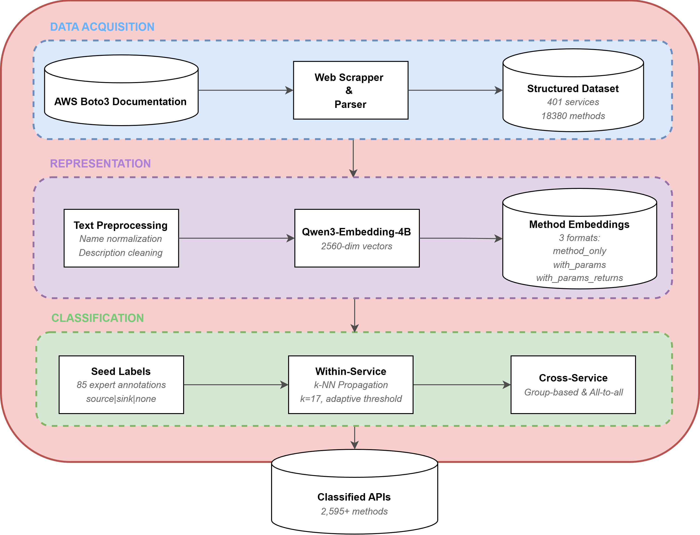

# From Documentation to Security Labels: Semantic Embedding-Based Classification of AWS API Methods for Taint Analysis

[](https://www.gnu.org/licenses/gpl-3.0)
[](https://www.python.org/downloads/)

> **Master's Thesis** — Alejandro Pardo Bascuñana  
> Universidad Politécnica de Madrid (UPM)  
> Escuela Técnica Superior de Ingeniería de Sistemas Informáticos  
> Master's Degree in Aprendizaje Automático y Datos Masivos  
> Supervisor: Dr. Jorge Blasco Alís — Madrid, 2026

> **Full text:** *[URL pending — to be published by UPM]*

---

## Overview



Cloud applications increasingly rely on Amazon Web Services (AWS), yet its 200+ services and thousands of API methods operate as proprietary black boxes where traditional source-code static analysis is impossible. This thesis presents a **documentation-driven framework** that automatically classifies AWS API methods as **sources**, **sinks**, or **neither** — the fundamental building blocks of **taint analysis** for vulnerability detection.

The pipeline scrapes the complete AWS Boto3 documentation, generates semantic embeddings with a large language model, and propagates security labels from a small set of manual annotations to thousands of unlabeled methods through semi-supervised learning.



### Key Numbers

| Metric | Value |
|---|---|
| AWS services scraped | 401 |
| API methods extracted | 18380 |
| Embedding dimensions | 2560 (Qwen3-Embedding-4B) |
| Manual seed labels | 85 (across 8 core services) |
| Best test accuracy | 85 % (macro F1 0.78, `with_params_returns`, k = 17) |
| Within-service propagation | 1167 predictions |
| Group-based cross-service | 1196 predictions (73.9 % high confidence) |
| All-to-all cross-service | 1428 predictions |

## Methodology



The research follows a four-stage pipeline:

1. **Data Collection** — Systematic web scraping of the AWS Boto3 documentation with a robust checkpoint system for resumable processing across network failures. Produces structured JSON files per service and method.

2. **Embedding Generation** — Each method is encoded in three text formats (*method_only*, *with_params*, *with_params_returns*) and embedded into 2 560-dimensional vectors using the **Qwen3-Embedding-4B** model via `sentence-transformers` with Flash Attention 2 on an NVIDIA RTX 6000 Ada GPU. Approximate nearest-neighbor indexes are built with **Annoy** (angular distance, 10 trees).

3. **Within-Service Label Propagation** — Starting from 85 manually labeled seed methods across 8 core AWS services (S3, DynamoDB, Lambda, EC2, IAM, SSM, SQS, SNS), a k-NN classifier iteratively propagates labels within each service using adaptive similarity thresholds (from 0.9 down to 0.5) and confidence scoring across up to 30 iterations.

4. **Cross-Service Label Propagation** — Two strategies extend coverage beyond the seed services:
   - **Group-based**: transfers labels between functionally related service groups (Storage, Compute, Database, Messaging, Security, Infrastructure).
   - **All-to-all**: unrestricted cross-service propagation with service exclusion rules.

   The group-based approach yields more reliable predictions than unconstrained propagation, confirming that domain knowledge provides a valuable inductive bias.

## Repository Structure

```
TFM-APB-MAADM/
├── parsing/                            # Stage 1 — Data collection
│   ├── main.py                         # Orchestration entry point
│   ├── service_processor.py            # Multi-service coordination
│   ├── parsers/
│   │   ├── method_parser.py            # Deep method extraction (params, returns)
│   │   ├── service_parser.py           # Service-level documentation parsing
│   │   └── service_url_parser.py       # URL discovery and validation
│   └── utils/
│       ├── config.py                   # Configuration and logging
│       ├── checkpoint_manager.py       # Resumable processing system
│       ├── text_cleaner.py             # HTML / text preprocessing
│       └── timeout.py                  # Timeout and error handling
├── notebooks/
│   ├── embeddings_creation/            # Stage 2 — Semantic embeddings
│   │   ├── embeddings_creator.ipynb    # Full embedding pipeline
│   │   └── embedding_checkpoint.py     # Embedding-specific checkpointing
│   └── label_propagation/              # Stages 3 & 4 — Label propagation
│       ├── label_propagator.ipynb      # Complete propagation workflow
│       ├── label_propagation.py        # Core propagation algorithms
│       ├── data_manager.py             # Data loading & Annoy index management
│       ├── evaluator.py                # Cross-validation & evaluation
│       ├── visualization.py            # Result dashboards and plots
│       ├── animation.py                # Propagation animation
│       ├── config.py                   # ML pipeline configuration
│       ├── labels.csv                  # Manual seed labels (85 methods)
│       ├── predictions/                # Propagation output JSONs
│       └── summaries/                  # Cross-method comparison JSONs
├── embeddings/                         # Pre-computed embeddings & indexes
│   ├── methods/                        # Method-level embeddings
│   ├── services/                       # Service-level embeddings
│   ├── annoy_indexes/                  # Fast similarity search indexes
│   └── embedding_metadata.json         # Format specifications
├── docs/                               # Raw scraped documentation
│   ├── services/                       # 401 service JSONs
│   ├── methods/                        # 18 380+ method JSONs by service
│   └── aws_api_urls.txt                # Discovered API endpoints
├── statistics/                         # Analysis & visualization
│   ├── EDA.ipynb                       # Exploratory data analysis
│   ├── within_service_statistics.py    # Within-service stats & figures
│   ├── cross_service_statistics.py     # Cross-service stats & figures
│   ├── figures/                        # Generated plots (PNG)
│   └── unique_action_verbs.txt         # Extracted API action vocabulary
├── labels.csv                          # Master label file
├── images/                             # README images
├── requirements.txt                    # Python dependencies
├── setup_cuda_jupyter.sh               # NVIDIA Docker / CUDA setup script
└── LICENSE                             # GPL v3
```

## Installation

```bash
git clone https://github.com/AlejandroPardworkyWorky/TFM-APB-MAADM.git
cd TFM-APB-MAADM
python -m venv .venv
# Linux / macOS
source .venv/bin/activate
# Windows
.venv\Scripts\activate

pip install -r requirements.txt
```

> **GPU note:** Embedding generation requires a CUDA-capable GPU (8 GB+ VRAM recommended; the thesis used an NVIDIA RTX 6000 Ada with 47.5 GB). For the NVIDIA Docker setup used during development, see `setup_cuda_jupyter.sh`.

## Usage

### 1. Data Collection (optional — data already provided)

```bash
cd parsing
python main.py          # ~12-24 h, resumable via checkpoint system
```

### 2. Embedding Generation

```bash
jupyter notebook notebooks/embeddings_creation/embeddings_creator.ipynb   # ~2-4 h with GPU
```

### 3. Label Propagation

```bash
jupyter notebook notebooks/label_propagation/label_propagator.ipynb       # ~30-60 min
```

### 4. Statistics & Visualization

```bash
# Exploratory data analysis
jupyter notebook statistics/EDA.ipynb

# Generate within-service figures
python statistics/within_service_statistics.py

# Generate cross-service figures
python statistics/cross_service_statistics.py
```

## Results

### Embedding Evaluation (held-out test set, 26 samples)

| Format | Best k | Accuracy | Macro F1 | Misclassifications |
|---|---|---|---|---|
| `method_only` | 13 | 0.69 | 0.66 | 8 |
| `with_params` | 17 | 0.77 | 0.72 | 6 |
| **`with_params_returns`** | **17** | **0.85** | **0.78** | **4** |

### Label Propagation Coverage

| Approach | Predictions | High Confidence (≥ 0.90) |
|---|---|---|
| Within-service | 1 167 | 89.3 % |
| Group cross-service (enhanced) | 1 196 | 73.9 % |
| All-to-all cross-service | 1 428 | 43.7 % |

Constraining cross-service propagation within functionally related service groups yields substantially more reliable predictions than unconstrained propagation, confirming that domain knowledge is a valuable inductive bias for cloud API classification.

## Limitations

- The prelabeled dataset (85 methods) is small; a larger seed set would strengthen conclusions.
- No ground-truth validation exists for propagated predictions beyond manual spot-checks.
- Results are specific to AWS Boto3; generalization to other cloud providers requires further study.
- The `none` class (neither source nor sink) proved hardest to classify due to its heterogeneous nature.

## Citation

```bibtex
@mastersthesis{pardo2026documentation,
    title   = {From Documentation to Security Labels: Semantic Embedding-Based
               Classification of AWS API Methods for Taint Analysis},
    author  = {Pardo Bascu{\~n}ana, Alejandro},
    year    = {2026},
    school  = {Universidad Polit{\'e}cnica de Madrid},
    type    = {Master's Thesis},
    note    = {Escuela T{\'e}cnica Superior de Ingenier{\'i}a de Sistemas
               Inform{\'a}ticos, Master's Degree in Aprendizaje Autom{\'a}tico
               y Datos Masivos. Supervised by Dr. Jorge Blasco Al{\'i}s},
    url     = {}
}
```

## License

This project is licensed under the [GNU General Public License v3.0](LICENSE).

## Acknowledgments

To my family, my tutor Jorge, my classmate Pedro, the SecLab team, and all the professors who made learning about AI a constant discovery.

---

*Alejandro Pardo Bascuñana — Universidad Politécnica de Madrid, 2026*
