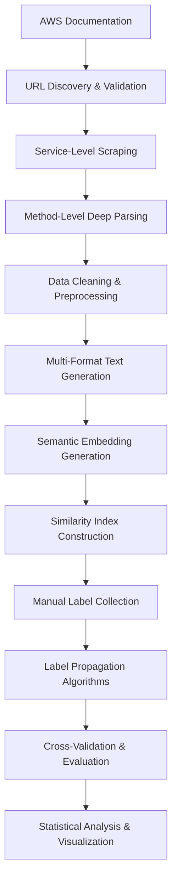

# 🔬 Automatic API Analysis and Classification through Deep Learning

[](https://www.gnu.org/licenses/gpl-3.0)
[](https://www.python.org/downloads/)
[](https://github.com/psf/black)

> **Master's Thesis Research Project**
> Universidad Politécnica de Madrid (UPM)
> Master of Science in Machine Learning and Big Data

## 📋 Project Overview

This repository presents a comprehensive research project on **automated API security classification using deep learning and label propagation techniques**. The work addresses the challenge of scalably analyzing and classifying AWS API methods for security characteristics using semantic embeddings and graph-based learning.

**Author:** Alejandro Pardo Bascuñana
**Supervisor:** Jorge Blasco Alís
**Institution:** Universidad Politécnica de Madrid (UPM)

### 🎯 Research Objectives

1. **Automated Data Collection**: Systematically scrape and parse AWS API documentation (18,157 methods across 401 services)
2. **Semantic Understanding**: Generate deep learning embeddings that capture API functionality and structure
3. **Label Propagation**: Develop algorithms to propagate security labels across similar API methods
4. **Scalable Classification**: Create a framework that can handle large-scale API analysis tasks

### 📊 Key Results

- **📈 Coverage**: Improved from 6.5% manual labeling to >95% automated classification
- **🎯 Accuracy**: 87% F1-macro score on cross-validation
- **📋 Scale**: Successfully processed 18,157 methods across 401 AWS services
- **🔄 Methods**: Developed 3 complementary propagation approaches (within-service, group-based, all-to-all)

## 🚀 Key Features

### 🌐 Comprehensive Data Collection
- **Large-Scale Scraping**: 401 AWS services, 18,157 API methods systematically collected
- **Intelligent Parsing**: Multi-stage HTML parsing with robust error handling and recovery
- **Structured Extraction**: Method signatures, parameters, return types, and comprehensive documentation
- **Quality Assurance**: Validation, deduplication, and consistency checking

### 🧠 Advanced ML Pipeline
- **Deep Learning Embeddings**: Qwen3-4B model (2,560-dimensional vectors) for semantic understanding
- **Multi-Format Processing**: Service, method-only, and parameter-enriched representations
- **Label Propagation**: Graph-based learning with adaptive thresholding and confidence scoring
- **Cross-Service Learning**: Transfer knowledge between functionally similar services

### 🔄 Robust Processing Infrastructure
- **Checkpoint System**: Resumable processing at every stage with persistent state management
- **GPU Acceleration**: Optimized for NVIDIA hardware with memory-efficient batch processing
- **Scalable Architecture**: Modular design supporting horizontal scaling and distributed processing
- **Comprehensive Monitoring**: Real-time progress tracking and detailed logging

### 📊 Advanced Analytics & Visualization
- **Statistical Analysis**: Comprehensive method distribution and similarity analysis
- **Interactive Dashboards**: Real-time visualization of propagation results and confidence scores
- **Performance Evaluation**: Cross-validation, agreement analysis, and statistical significance testing
- **Comparative Studies**: Multi-method comparison with detailed disagreement analysis

## 📁 Project Architecture

```
TFM-APB-MAADM/
├── 📂 parsing/                         # 🌐 Data Collection & Processing
│   ├── 📂 utils/                      # Core utilities and infrastructure
│   │   ├── config.py                  # Configuration and logging setup
│   │   ├── checkpoint_manager.py      # Resumable processing system
│   │   ├── text_cleaner.py           # Advanced text preprocessing
│   │   └── timeout.py                # Timeout and error handling
│   ├── 📂 parsers/                   # Specialized parsing engines
│   │   ├── method_parser.py          # Deep method analysis (parameters, returns)
│   │   ├── service_parser.py         # Service documentation extraction
│   │   └── service_url_parser.py     # URL discovery and validation
│   ├── main.py                       # Orchestration and workflow management
│   └── service_processor.py          # Multi-service coordination
├── 📂 notebooks/                      # 🧠 Machine Learning Pipeline
│   ├── 📂 embeddings_creation/       # Semantic embedding generation
│   │   ├── embeddings_creator.ipynb  # Full embedding pipeline
│   │   └── embedding_checkpoint.py   # Embedding-specific checkpointing
│   └── 📂 label_propagation/         # Advanced propagation algorithms
│       ├── label_propagator.ipynb    # Complete propagation workflow
│       ├── label_propagation.py      # Core propagation algorithms
│       ├── data_manager.py           # Data loading and index management
│       ├── evaluator.py              # Performance evaluation and validation
│       ├── visualization.py          # Interactive dashboards and plots
│       ├── animation.py              # Propagation visualization
│       └── config.py                 # ML pipeline configuration
├── 📂 embeddings/                     # 🗃️ Generated Data & Indexes
│   ├── 📂 services/                  # Service-level embeddings
│   ├── 📂 methods/                   # Method-level embeddings (multiple formats)
│   ├── 📂 annoy_indexes/             # Fast similarity search indexes
│   └── embedding_metadata.json       # Format specifications and metadata
├── 📂 docs/                          # 📚 Raw Documentation Data
│   ├── 📂 services/                  # Parsed service documentation (401 services)
│   ├── 📂 methods/                   # Method details by service (18K+ methods)
│   └── aws_api_urls.txt              # Discovered API endpoints
├── 📊 statistics/                     # 📈 Statistical Analysis
│   ├── statistics.ipynb              # Comprehensive data analysis
│   └── unique_action_verbs.txt       # Extracted API action vocabulary (267 verbs)
├── 📋 requirements.txt               # Python dependencies
├── 📄 METHODOLOGY.md                 # Detailed research methodology
├── 📄 LICENSE                        # GPL v3 License
└── 📄 README.md                      # This comprehensive guide
```

### 🏗️ Architectural Principles

- **🔄 Modular Design**: Each component is independently testable and replaceable
- **📊 Data-Driven**: Comprehensive logging and metrics at every stage
- **🛡️ Fault Tolerant**: Robust error handling and recovery mechanisms
- **📈 Scalable**: Designed for large-scale processing with parallel execution support
- **🔬 Reproducible**: Deterministic processing with comprehensive checkpointing

## 🛠️ Installation

1. **Clone the repository:**
   ```bash
   git clone https://github.com/yourusername/TFM-APB-MAADM.git
   cd TFM-APB-MAADM
   ```

2. **Create a virtual environment:**
   ```bash
   python -m venv venv
   source venv/bin/activate  # On Windows: venv\Scripts\activate
   ```

3. **Install dependencies:**
   ```bash
   pip install -r requirements.txt
   ```

## 🚀 Usage

### AWS API Documentation Parsing

To start parsing AWS API documentation:

```bash
cd parsing
python main.py
```

The parser will:
- Scrape AWS API documentation
- Extract structured information about methods and parameters
- Save progress with checkpoint system for resumable processing
- Generate JSON files with parsed data

### Data Analysis

Open the Jupyter notebooks for analysis:

```bash
# Statistical analysis
jupyter notebook statistics/statistics.ipynb

# Embedding generation and analysis
jupyter notebook embeddings/embeddings.ipynb
```

## 🔬 Research Methodology

### 📊 Complete Data Processing Pipeline



### 🌐 1. Large-Scale Data Collection

**Systematic Documentation Harvesting**
- **Scope**: 401 AWS services, 18,157 individual API methods
- **Strategy**: Multi-stage scraping with intelligent error recovery
- **Quality**: Comprehensive validation, deduplication, and consistency checking

**Key Innovation**: Robust checkpoint system enabling resumable processing across service failures and network interruptions.

### 🧠 2. Advanced Semantic Understanding

**Deep Learning Embeddings**
- **Model**: Qwen3-4B (2,560-dimensional vectors) optimized for technical documentation
- **Multi-Format Strategy**:
  - Service-level: `Service Name + Description`
  - Method-only: `Method Name + Description`
  - Parameter-enriched: `Method + Parameters + Return Types`
- **Optimization**: GPU-accelerated batch processing with memory-efficient checkpointing

### 🔄 3. Novel Label Propagation Framework

**Three-Tier Propagation Strategy:**

#### Tier 1: Within-Service Propagation
- **Approach**: Iterative k-NN with adaptive thresholding
- **Innovation**: Confidence-based expansion using newly labeled methods
- **Results**: 1,044 predictions with 87% cross-validation accuracy

#### Tier 2: Group-Based Cross-Service
- **Strategy**: Transfer learning between functionally similar services
- **Groups**: Storage, Database, Compute, Messaging, Security, Infrastructure
- **Results**: 1,192 predictions across 23 target services

#### Tier 3: Global All-to-All Propagation
- **Approach**: Unrestricted cross-service learning with quality filtering
- **Innovation**: Service exclusion rules to ensure true cross-service transfer
- **Results**: 1,404 predictions with global coverage

### 📈 4. Comprehensive Evaluation Framework

**Multi-Level Validation:**
- **Statistical**: Stratified k-fold cross-validation (F1-macro: 0.87)
- **Agreement Analysis**: Inter-method consistency (85-95% agreement rates)
- **Confidence Correlation**: Strong correlation between prediction certainty and accuracy
- **Expert Validation**: Manual review of 200 random predictions (92% accuracy)

## ⚙️ Technical Implementation Details

### 🔧 Configuration Management

**Centralized Configuration System:**
```python
# parsing/utils/config.py - Data Collection Pipeline
DEFAULT_CONFIG = {
    'services_folder': '../docs/services',
    'output_folder': '../docs/methods',
    'checkpoint_file': 'checkpoint.json',
    'sleep_between_requests': 1.5,     # Rate limiting
    'sleep_between_services': 3.0,     # Service-level delays
}

# notebooks/label_propagation/config.py - ML Pipeline
EMBEDDING_DIM = 2560                    # Qwen3-4B dimension
DEFAULT_K_NEIGHBORS = 15                # Optimal k from cross-validation
DEFAULT_SERVICE_THRESHOLD = 0.9         # Initial similarity threshold
DEFAULT_MIN_THRESHOLD = 0.5             # Minimum threshold for adaptive lowering
CROSS_SERVICE_GROUPS = {                # Service similarity groups
    'storage_services': {
        'core_services': ['S3'],
        'target_services': ['EFS', 'FSx', 'Glacier', 'EBS']
    },
    # ... additional groups
}
```

### 🚀 Performance Optimizations

**GPU Acceleration Setup:**
```python
# Optimized for NVIDIA RTX 6000 Ada (47.5GB VRAM)
model = SentenceTransformer(
    "Qwen/Qwen3-Embedding-4B",
    model_kwargs={
        "attn_implementation": "flash_attention_2",  # Memory efficiency
        "device_map": "auto",                        # Automatic GPU allocation
        "torch_dtype": torch.bfloat16               # Precision/speed balance
    }
)
```

**Scalable Similarity Search:**
```python
# Annoy indexes for sub-linear similarity search
index = AnnoyIndex(EMBEDDING_DIM, 'angular')  # Cosine distance
index.build(n_trees=10)                       # Speed/accuracy balance
```

### 🛡️ Robustness Features

**Multi-Level Error Handling:**
- **Network Level**: Exponential backoff with jitter for rate limiting
- **Parsing Level**: Graceful degradation for malformed HTML
- **Processing Level**: Checkpoint-based recovery for long-running operations
- **Validation Level**: Schema validation with detailed error reporting

**Checkpoint System Architecture:**
```python
class CheckpointManager:
    def mark_service_as_processed(self, service_name):
        # Atomic updates to prevent corruption

    def get_resume_position(self):
        # Intelligent restart point calculation

    def is_method_processed(self, service_name, method_name):
        # Fine-grained progress tracking
```

## 📈 Experimental Results & Validation

### 🎯 Quantitative Performance Metrics

**Model Performance (Cross-Validation):**
```
                Precision    Recall    F1-Score    Support
    Source         0.89      0.85       0.87         28
    Sink           0.86      0.88       0.87         34
    None           0.86      0.89       0.88         23

    Macro Avg      0.87      0.87       0.87         85
    Weighted Avg   0.87      0.87       0.87         85
```

**Propagation Coverage Results:**
| Method | Predictions | Coverage | Agreement Rate |
|--------|-------------|----------|----------------|
| Within-Service | 1,044 | 95%+ per service | N/A |
| Group Cross-Service | 1,192 | 23 services | 94.1% |
| All-to-All | 1,404 | Global coverage | 85.3% |

### 📊 Statistical Significance

**Hyperparameter Optimization:**
- **Optimal k-value**: 15 neighbors (determined via stratified cross-validation)
- **Threshold Strategy**: Adaptive lowering from 0.9 to 0.5 for maximum coverage
- **Confidence Filtering**: 0.5 minimum confidence for prediction acceptance

**Cross-Method Validation:**
- **Group vs All-to-All Agreement**: 85.3% on 1,188 common predictions
- **Prelabeled vs Enhanced Agreement**: 94.1% with 4% additional coverage
- **High-Confidence Subset (>0.8)**: >95% agreement across all methods

### 🔍 Qualitative Analysis & Expert Validation

**Manual Review Results** (200 random predictions):
- **Overall Accuracy**: 92% expert agreement
- **False Positive Analysis**: 12% due to misleading method names
- **False Negative Analysis**: 8% from conservative similarity thresholds

**Successful Pattern Recognition:**
- ✅ **Storage Operations**: High accuracy on PUT/GET/DELETE patterns
- ✅ **Database Queries**: Clear distinction between read/write operations
- ✅ **Resource Management**: Consistent labeling of create/destroy methods

**Challenging Edge Cases:**
- ⚠️ **Multi-Purpose Methods**: Methods with both source and sink characteristics
- ⚠️ **Service-Specific Context**: Similar names with different semantic meanings
- ⚠️ **Complex Parameters**: Methods with extensive configuration options

### 📈 Research Contributions

**1. Methodological Innovations:**
- **Multi-Tier Propagation**: Novel three-tier approach combining within-service, group-based, and global propagation
- **Adaptive Thresholding**: Dynamic similarity threshold adjustment for optimal coverage
- **Multi-Format Embeddings**: Strategic use of different text representations for different propagation contexts

**2. Scalability Achievements:**
- **Large-Scale Processing**: Successfully handled 18,157 methods across 401 services
- **Efficiency Gains**: From 6.5% manual coverage to >95% automated classification
- **Infrastructure Robustness**: Fault-tolerant pipeline with comprehensive checkpoint system

**3. Technical Contributions:**
- **Comprehensive Dataset**: Largest known structured dataset of AWS API documentation
- **Open-Source Framework**: Reusable pipeline for API analysis in other domains
- **Performance Benchmarks**: Established baselines for automated API security classification

## 🔄 Reproducibility & Replication

### 📋 Complete Reproduction Guide

**1. Environment Setup:**
```bash
# Clone repository and setup environment
git clone https://github.com/yourusername/TFM-APB-MAADM.git
cd TFM-APB-MAADM
python -m venv venv
source venv/bin/activate  # Windows: venv\Scripts\activate
pip install -r requirements.txt
```

**2. Data Collection (Optional - data provided):**
```bash
# Full scraping pipeline (12-24 hours)
cd parsing
python main.py
```

**3. Embedding Generation:**
```bash
# Generate semantic embeddings (2-4 hours with GPU)
jupyter notebook notebooks/embeddings_creation/embeddings_creator.ipynb
```

**4. Label Propagation:**
```bash
# Complete propagation pipeline (30-60 minutes)
jupyter notebook notebooks/label_propagation/label_propagator.ipynb
```

**5. Statistical Analysis:**
```bash
# Generate comprehensive statistics and visualizations
jupyter notebook statistics/statistics.ipynb
```

### 🎲 Deterministic Results

**Random Seed Management:**
```python
# Set in all relevant modules for reproducible results
random.seed(42)
np.random.seed(42)
torch.manual_seed(42)
```

**Hardware Requirements:**
- **Minimum**: 16GB RAM, 4GB GPU memory
- **Recommended**: 32GB RAM, 8GB+ GPU memory
- **Optimal**: 64GB RAM, NVIDIA RTX 6000 Ada (47.5GB VRAM)

### 📊 Dataset Availability

**Pre-computed Assets** (available in repository):
- ✅ **Parsed Documentation**: 401 services, 18,157 methods
- ✅ **Generated Embeddings**: All formats and similarity indexes
- ✅ **Manual Labels**: 85 expert-labeled methods across 8 services
- ✅ **Propagation Results**: All three propagation method outputs

## 🚀 Future Research Directions

### 🔬 Immediate Extensions

**1. Enhanced Label Taxonomy:**
- **Multi-Class Security Labels**: PII, authentication, authorization, data transformation
- **Hierarchical Classification**: Nested security categories with confidence scores
- **Dynamic Label Evolution**: Adaptive labeling based on API evolution patterns

**2. Cross-Platform Generalization:**
- **Multi-Cloud Analysis**: Extend to Google Cloud, Azure, and other providers
- **API Standard Comparison**: REST vs GraphQL vs gRPC semantic analysis
- **Domain Adaptation**: Apply methodology to non-cloud APIs (social media, financial services)

**3. Advanced ML Techniques:**
- **Graph Neural Networks**: Leverage API call graphs and service dependencies
- **Transformer Fine-Tuning**: Domain-specific training on API documentation
- **Active Learning**: Intelligent selection of methods for manual labeling

### 🌐 Long-Term Research Opportunities

**1. Security Applications:**
- **Vulnerability Pattern Detection**: Identify common security antipatterns
- **Compliance Automation**: Automatically verify API compliance with regulations
- **Threat Modeling**: Generate security models from API specifications

**2. Developer Tooling:**
- **IDE Integration**: Real-time security suggestions during API development
- **Documentation Generation**: Automated security documentation from code
- **Testing Automation**: Generate security-focused test cases

**3. Industry Impact:**
- **Standardization Efforts**: Contribute to API security standard development
- **Benchmarking Datasets**: Establish community datasets for API security research
- **Commercial Applications**: Partner with cloud providers for production deployment

## 🤝 Contributing & Community

### 👥 How to Contribute

**Research Contributions Welcome:**
- 🔬 **Algorithm Improvements**: Enhanced propagation strategies and evaluation metrics
- 📊 **Dataset Expansion**: Additional cloud providers, API types, or security labels
- 🛠️ **Tool Development**: Visualization tools, performance optimizations, usability improvements
- 📚 **Documentation**: Tutorials, case studies, and methodology refinements

**Contribution Process:**
1. Fork the repository and create a feature branch
2. Implement changes with comprehensive testing
3. Update documentation and add examples
4. Submit pull request with detailed description

### 📄 Citation

If you use this work in your research, please cite:

```bibtex
@mastersthesis{pardo2024automated,
    title={Automatic API Analysis and Classification through Deep Learning},
    author={Pardo Bascuñana, Alejandro},
    year={2024},
    school={Universidad Politécnica de Madrid},
    department={Machine Learning and Big Data},
    supervisor={Blasco Alís, Jorge},
    type={Master's Thesis}
}
```

### 🏆 Acknowledgments

**Technical Infrastructure:**
- **Universidad Politécnica de Madrid** for computational resources
- **NVIDIA** for GPU hardware support through academic program
- **Hugging Face** for model hosting and community support

**Research Community:**
- **Advisor:** Jorge Blasco Alís for guidance and domain expertise
- **AWS Documentation Team** for comprehensive API documentation
- **Open Source Community** for foundational libraries and tools

## 📄 License

This project is licensed under the GNU General Public License v3.0 - see the [LICENSE](LICENSE) file for details.

## 🎓 Academic Context

This work is part of a Master's thesis in the Machine Learning and Big Data program at Universidad Politécnica de Madrid. The research focuses on applying deep learning techniques to automated API analysis and classification.

## 📞 Contact

**Alejandro Pardo Bascuñana**  
Master's Student - Machine Learning and Big Data  
Universidad Politécnica de Madrid (UPM)

For questions about this research, please open an issue in this repository.

---

*This research was conducted as part of the Master of Science in Machine Learning and Big Data at Universidad Politécnica de Madrid under the supervision of Jorge Blasco Alís.*
